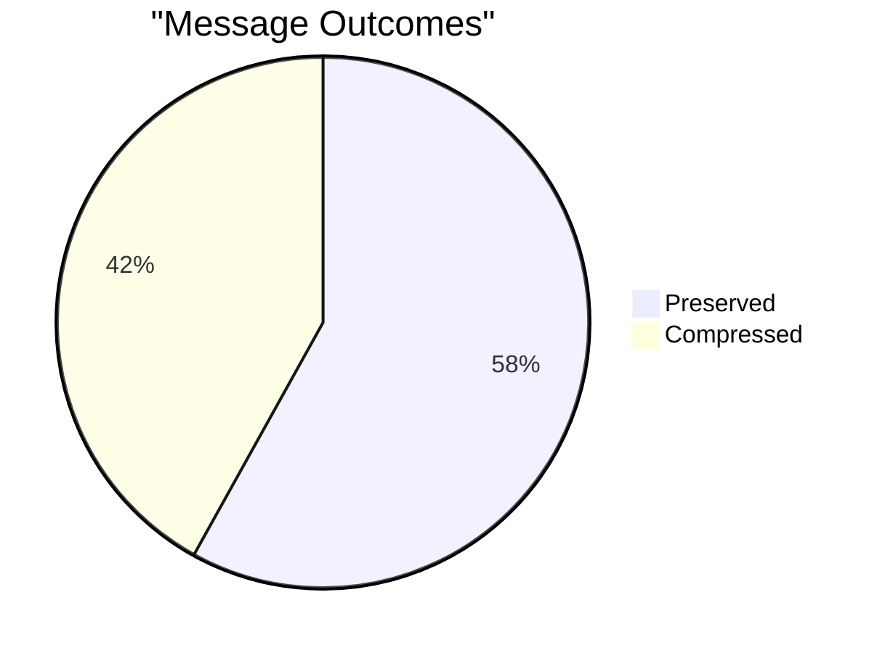
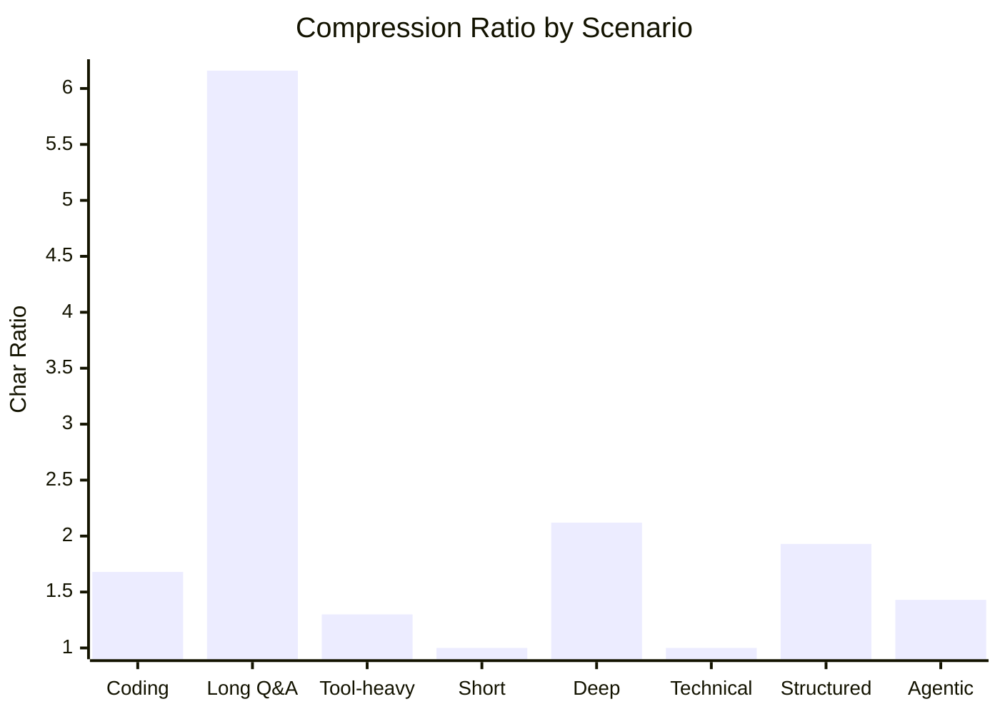
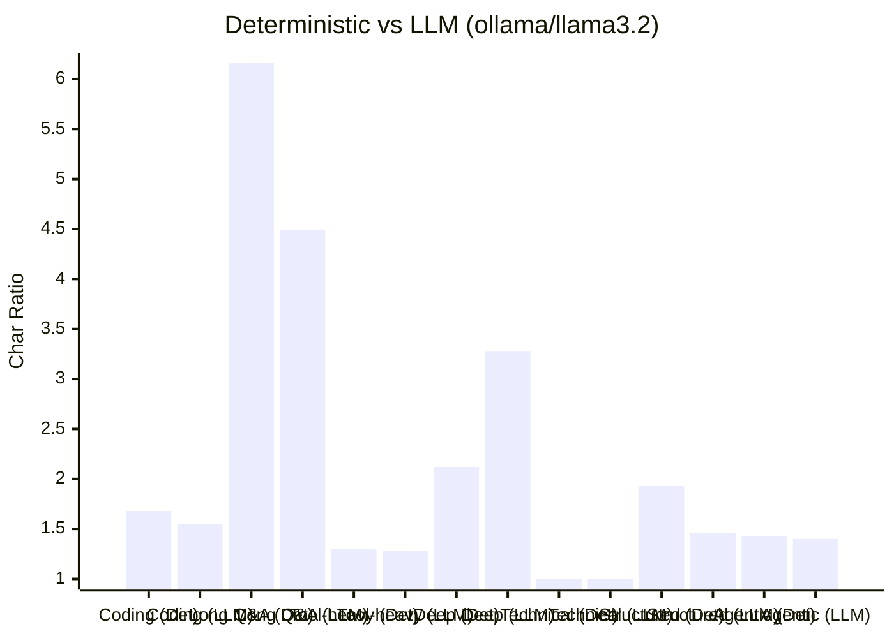

# Benchmark Results

[Back to README](../README.md) | [All docs](README.md) | [Handbook](benchmarks.md)

*Auto-generated by `npm run bench:save`. Do not edit manually.*

**v1.0.0** · Generated: 2026-02-25

   

## Summary

| Metric | Value |
| --- | --- |
| Scenarios | 8 |
| Average compression | 2.08x |
| Best compression | 6.16x |
| Round-trip integrity | all PASS |

## Compression by Scenario

> **8 scenarios** · **2.08x** avg ratio · **1.00x** – **6.16x** range · all round-trips PASS

| Scenario | Ratio | Reduction | Token Ratio | Messages | Compressed | Preserved |
| --- | ---: | ---: | ---: | ---: | ---: | ---: |
| Coding assistant | 1.68 | 41% | 1.67 | 13 | 5 | 8 |
| Long Q&A | 6.16 | 84% | 6.11 | 10 | 4 | 6 |
| Tool-heavy | 1.30 | 23% | 1.29 | 18 | 2 | 16 |
| Short conversation | 1.00 | 0% | 1.00 | 7 | 0 | 7 |
| Deep conversation | 2.12 | 53% | 2.12 | 51 | 50 | 1 |
| Technical explanation | 1.00 | 0% | 1.00 | 11 | 0 | 11 |
| Structured content | 1.93 | 48% | 1.92 | 12 | 2 | 10 |
| Agentic coding session | 1.43 | 30% | 1.43 | 33 | 2 | 31 |

## Deduplication Impact

```mermaid
xychart-beta
    title "Deduplication Impact (recencyWindow=0)"
    x-axis ["Long Q&A", "Agentic"]
    y-axis "Char Ratio"
    bar [5.14, 1.14]
    bar [6.16, 1.43]
```

*First bar: no dedup · Second bar: with dedup*

| Scenario | No Dedup (rw=0) | Dedup (rw=0) | No Dedup (rw=4) | Dedup (rw=4) | Deduped |
| --- | ---: | ---: | ---: | ---: | ---: |
| Coding assistant | 1.68 | 1.68 | 1.51 | 1.51 | 0 |
| Long Q&A | 5.14 | 6.16 | 1.90 | 2.03 | 1 |
| Tool-heavy | 1.30 | 1.30 | 1.30 | 1.30 | 0 |
| Short conversation | 1.00 | 1.00 | 1.00 | 1.00 | 0 |
| Deep conversation | 2.12 | 2.12 | 1.95 | 1.95 | 0 |
| Technical explanation | 1.00 | 1.00 | 1.00 | 1.00 | 0 |
| Structured content | 1.93 | 1.93 | 1.37 | 1.37 | 0 |
| Agentic coding session | 1.14 | 1.43 | 1.14 | 1.43 | 4 |

### Fuzzy Dedup

| Scenario | Exact Deduped | Fuzzy Deduped | Ratio |
| --- | ---: | ---: | ---: |
| Coding assistant | 0 | 0 | 1.68 |
| Long Q&A | 1 | 0 | 6.16 |
| Tool-heavy | 0 | 0 | 1.30 |
| Short conversation | 0 | 0 | 1.00 |
| Deep conversation | 0 | 0 | 2.12 |
| Technical explanation | 0 | 0 | 1.00 |
| Structured content | 0 | 0 | 1.93 |
| Agentic coding session | 4 | 2 | 2.23 |

## Token Budget

Target: **2000 tokens** · 1/4 fit

| Scenario | Dedup | Tokens | Fits | recencyWindow | Compressed | Preserved | Deduped |
| --- | --- | ---: | --- | ---: | ---: | ---: | ---: |
| Deep conversation | no | 3738 | no | 0 | 50 | 1 | 0 |
| Deep conversation | yes | 3738 | no | 0 | 50 | 1 | 0 |
| Agentic coding session | no | 2345 | no | 0 | 4 | 33 | 0 |
| Agentic coding session | yes | 1957 | yes | 9 | 1 | 32 | 4 |

## LLM vs Deterministic

> Results are **non-deterministic** — LLM outputs vary between runs. Saved as reference data, not used for regression testing.

> **Key findings:**
> LLM wins on prose-heavy scenarios: Deep conversation, Technical explanation
> Deterministic wins on structured/technical content: Coding assistant, Long Q&A, Tool-heavy, Structured content

### ollama (llama3.2)

*Generated: 2026-02-25*

Scenario details

| Scenario | Method | Char Ratio | Token Ratio | vsDet | Compressed | Preserved | Round-trip | Time |
| --- | --- | ---: | ---: | ---: | ---: | ---: | --- | ---: |
| Coding assistant | deterministic | 1.68 | 1.67 | - | 5 | 8 | PASS | 0ms |
|  | llm-basic | 1.48 | 1.48 | 0.88 | 5 | 8 | PASS | 5.9s |
|  | llm-escalate | 1.55 | 1.55 | 0.92 | 5 | 8 | PASS | 3.0s |
| Long Q&A | deterministic | 6.16 | 6.11 | - | 4 | 6 | PASS | 1ms |
|  | llm-basic | 4.31 | 4.28 | 0.70 | 4 | 6 | PASS | 4.1s |
|  | llm-escalate | 4.49 | 4.46 | 0.73 | 4 | 6 | PASS | 3.7s |
| Tool-heavy | deterministic | 1.30 | 1.29 | - | 2 | 16 | PASS | 2ms |
|  | llm-basic | 1.12 | 1.11 | 0.86 | 2 | 16 | PASS | 2.3s |
|  | llm-escalate | 1.28 | 1.28 | 0.99 | 2 | 16 | PASS | 2.8s |
| Deep conversation | deterministic | 2.12 | 2.12 | - | 50 | 1 | PASS | 3ms |
|  | llm-basic | 3.12 | 3.11 | 1.47 | 50 | 1 | PASS | 22.7s |
|  | llm-escalate | 3.28 | 3.26 | 1.54 | 50 | 1 | PASS | 23.3s |
| Technical explanation | deterministic | 1.00 | 1.00 | - | 0 | 11 | PASS | 1ms |
|  | llm-basic | 1.00 | 1.00 | 1.00 | 0 | 11 | PASS | 3.2s |
|  | llm-escalate | 1.00 | 1.00 | 1.00 | 2 | 9 | PASS | 785ms |
| Structured content | deterministic | 1.93 | 1.92 | - | 2 | 10 | PASS | 0ms |
|  | llm-basic | 1.46 | 1.45 | 0.75 | 2 | 10 | PASS | 3.5s |
|  | llm-escalate | 1.38 | 1.38 | 0.71 | 2 | 10 | PASS | 3.7s |
| Agentic coding session | deterministic | 1.43 | 1.43 | - | 2 | 31 | PASS | 1ms |
|  | llm-basic | 1.35 | 1.34 | 0.94 | 2 | 31 | PASS | 3.3s |
|  | llm-escalate | 1.40 | 1.40 | 0.98 | 2 | 31 | PASS | 5.4s |

#### Token Budget (target: 2000 tokens)

| Scenario | Method | Tokens | Fits | recencyWindow | Ratio | Round-trip | Time |
| --- | --- | ---: | --- | ---: | ---: | --- | ---: |
| Deep conversation | deterministic | 3738 | false | 0 | 2.12 | PASS | 12ms |
|  | llm-escalate | 2593 | false | 0 | 3.08 | PASS | 132.0s |
| Agentic coding session | deterministic | 1957 | true | 9 | 1.36 | PASS | 2ms |
|  | llm-escalate | 2003 | false | 9 | 1.33 | PASS | 4.1s |

### openai (gpt-4.1-mini)

*Generated: 2026-02-25*

Scenario details

| Scenario | Method | Char Ratio | Token Ratio | vsDet | Compressed | Preserved | Round-trip | Time |
| --- | --- | ---: | ---: | ---: | ---: | ---: | --- | ---: |
| Coding assistant | deterministic | 1.68 | 1.67 | - | 5 | 8 | PASS | 0ms |
|  | llm-basic | 1.64 | 1.63 | 0.98 | 5 | 8 | PASS | 5.6s |
|  | llm-escalate | 1.63 | 1.63 | 0.97 | 5 | 8 | PASS | 6.0s |
| Long Q&A | deterministic | 6.16 | 6.11 | - | 4 | 6 | PASS | 1ms |
|  | llm-basic | 5.37 | 5.33 | 0.87 | 4 | 6 | PASS | 5.9s |
|  | llm-escalate | 5.35 | 5.31 | 0.87 | 4 | 6 | PASS | 7.0s |
| Tool-heavy | deterministic | 1.30 | 1.29 | - | 2 | 16 | PASS | 0ms |
|  | llm-basic | 1.11 | 1.10 | 0.85 | 2 | 16 | PASS | 3.5s |
|  | llm-escalate | 1.12 | 1.12 | 0.86 | 2 | 16 | PASS | 5.3s |
| Deep conversation | deterministic | 2.12 | 2.12 | - | 50 | 1 | PASS | 3ms |
|  | llm-basic | 2.34 | 2.33 | 1.10 | 50 | 1 | PASS | 50.4s |
|  | llm-escalate | 2.37 | 2.36 | 1.11 | 50 | 1 | PASS | 50.8s |
| Technical explanation | deterministic | 1.00 | 1.00 | - | 0 | 11 | PASS | 1ms |
|  | llm-basic | 1.00 | 1.00 | 1.00 | 1 | 10 | PASS | 2.6s |
|  | llm-escalate | 1.00 | 1.00 | 1.00 | 1 | 10 | PASS | 3.3s |
| Structured content | deterministic | 1.93 | 1.92 | - | 2 | 10 | PASS | 0ms |
|  | llm-basic | 1.23 | 1.23 | 0.64 | 2 | 10 | PASS | 10.2s |
|  | llm-escalate | 1.29 | 1.29 | 0.67 | 2 | 10 | PASS | 4.8s |
| Agentic coding session | deterministic | 1.43 | 1.43 | - | 2 | 31 | PASS | 1ms |
|  | llm-basic | 1.43 | 1.43 | 1.00 | 2 | 31 | PASS | 5.8s |
|  | llm-escalate | 1.32 | 1.32 | 0.93 | 1 | 32 | PASS | 9.5s |

#### Token Budget (target: 2000 tokens)

| Scenario | Method | Tokens | Fits | recencyWindow | Ratio | Round-trip | Time |
| --- | --- | ---: | --- | ---: | ---: | --- | ---: |
| Deep conversation | deterministic | 3738 | false | 0 | 2.12 | PASS | 10ms |
|  | llm-escalate | 3391 | false | 0 | 2.35 | PASS | 280.5s |
| Agentic coding session | deterministic | 1957 | true | 9 | 1.36 | PASS | 2ms |
|  | llm-escalate | 1915 | true | 3 | 1.39 | PASS | 28.1s |

## Methodology

- All deterministic results use the same input → same output guarantee
- Metrics: compression ratio, token ratio, message counts, dedup counts
- Timing is excluded from baselines (hardware-dependent)
- LLM benchmarks are saved as reference data, not used for regression testing
- Round-trip integrity is verified for every scenario (compress then uncompress)
