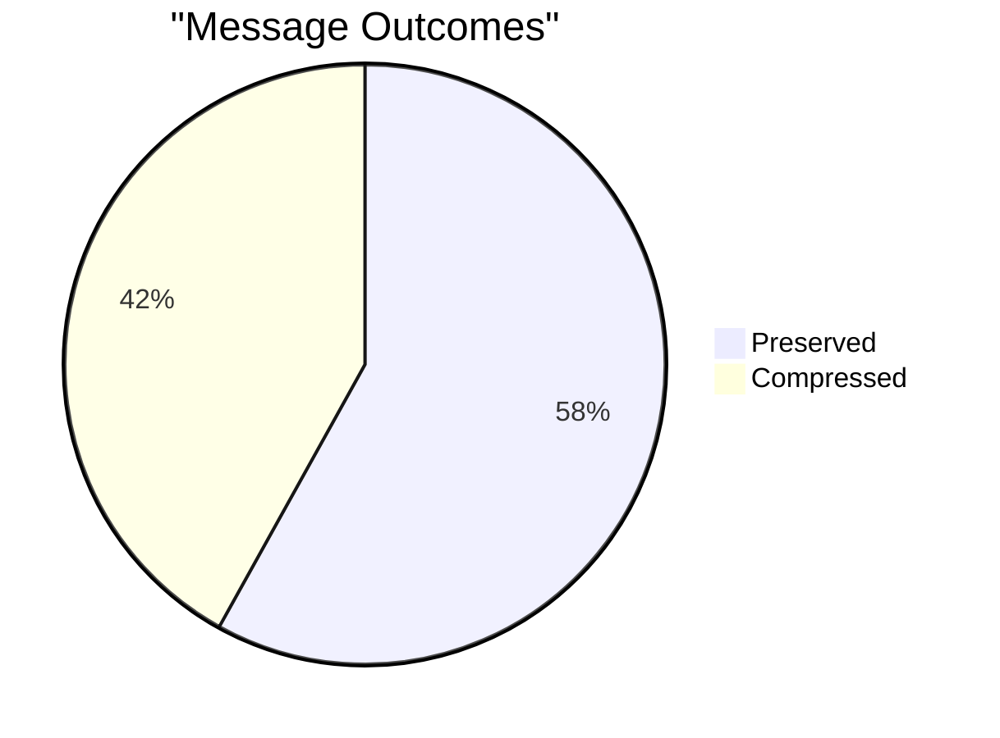
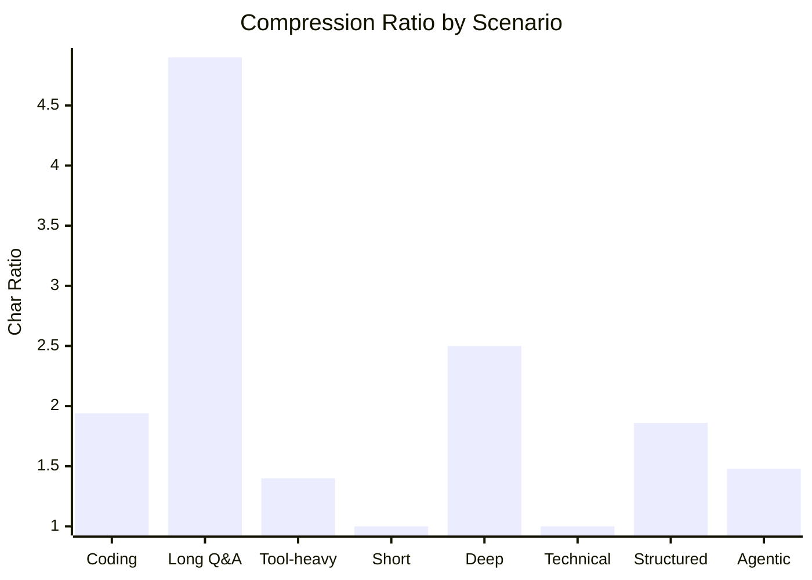

# Benchmark Results

[Back to README](../README.md) | [All docs](README.md) | [Handbook](benchmarks.md)

_Auto-generated by `npm run bench:save`. Do not edit manually._

**v1.5.0** · Generated: 2026-04-09

    

## Summary

| Metric                   | Value    |
| ------------------------ | -------- |
| Scenarios                | 8        |
| Average compression      | 2.01x    |
| Best compression         | 4.90x    |
| Round-trip integrity     | all PASS |
| Average quality score    | 0.985    |
| Average entity retention | 96%      |


```mermaid
pie title "Message Outcomes"
    "Preserved" : 90
    "Compressed" : 65
```

## Compression by Scenario

> **8 scenarios** · **2.01x** avg ratio · **1.00x** – **4.90x** range · all round-trips PASS


```mermaid
xychart-beta
    title "Compression Ratio by Scenario"
    x-axis ["Coding", "Long Q&A", "Tool-heavy", "Short", "Deep", "Technical", "Structured", "Agentic"]
    y-axis "Char Ratio"
    bar [1.94, 4.90, 1.40, 1.00, 2.50, 1.00, 1.86, 1.48]
```

| Scenario               | Ratio | Reduction | Token Ratio | Messages | Compressed | Preserved |
| ---------------------- | ----: | --------: | ----------: | -------: | ---------: | --------: |
| Coding assistant       |  1.94 |       48% |        1.93 |       13 |          5 |         8 |
| Long Q&A               |  4.90 |       80% |        4.88 |       10 |          4 |         6 |
| Tool-heavy             |  1.40 |       29% |        1.39 |       18 |          2 |        16 |
| Short conversation     |  1.00 |        0% |        1.00 |        7 |          0 |         7 |
| Deep conversation      |  2.50 |       60% |        2.49 |       51 |         50 |         1 |
| Technical explanation  |  1.00 |        0% |        1.00 |       11 |          0 |        11 |
| Structured content     |  1.86 |       46% |        1.85 |       12 |          2 |        10 |
| Agentic coding session |  1.48 |       32% |        1.47 |       33 |          2 |        31 |

## Deduplication Impact


```mermaid
xychart-beta
    title "Deduplication Impact (recencyWindow=0)"
    x-axis ["Long Q&A", "Agentic"]
    y-axis "Char Ratio"
    bar [4.00, 1.20]
    bar [4.90, 1.48]
```

_First bar: no dedup · Second bar: with dedup_

| Scenario               | No Dedup (rw=0) | Dedup (rw=0) | No Dedup (rw=4) | Dedup (rw=4) | Deduped |
| ---------------------- | --------------: | -----------: | --------------: | -----------: | ------: |
| Coding assistant       |            1.94 |         1.94 |            1.61 |         1.61 |       0 |
| Long Q&A               |            4.00 |         4.90 |            1.76 |         1.92 |       1 |
| Tool-heavy             |            1.40 |         1.40 |            1.40 |         1.40 |       0 |
| Short conversation     |            1.00 |         1.00 |            1.00 |         1.00 |       0 |
| Deep conversation      |            2.50 |         2.50 |            2.24 |         2.24 |       0 |
| Technical explanation  |            1.00 |         1.00 |            1.00 |         1.00 |       0 |
| Structured content     |            1.86 |         1.86 |            1.33 |         1.33 |       0 |
| Agentic coding session |            1.20 |         1.48 |            1.20 |         1.48 |       4 |

### Fuzzy Dedup

| Scenario               | Exact Deduped | Fuzzy Deduped | Ratio | vs Base |
| ---------------------- | ------------: | ------------: | ----: | ------: |
| Coding assistant       |             0 |             0 |  1.94 |       - |
| Long Q&A               |             1 |             0 |  4.90 |       - |
| Tool-heavy             |             0 |             0 |  1.40 |       - |
| Short conversation     |             0 |             0 |  1.00 |       - |
| Deep conversation      |             0 |             0 |  2.50 |       - |
| Technical explanation  |             0 |             0 |  1.00 |       - |
| Structured content     |             0 |             0 |  1.86 |       - |
| Agentic coding session |             4 |             2 |  2.35 |    +59% |

## ANCS-Inspired Features

> Importance scoring preserves high-value messages outside the recency window. Contradiction detection compresses superseded messages.

| Scenario               | Baseline | +Importance | +Contradiction | Combined | Imp. Preserved | Contradicted |
| ---------------------- | -------: | ----------: | -------------: | -------: | -------------: | -----------: |
| Deep conversation      |     2.37 |        2.37 |           2.37 |     2.37 |              0 |            0 |
| Agentic coding session |     1.47 |        1.24 |           1.47 |     1.24 |              4 |            0 |
| Iterative design       |     1.62 |        1.26 |           1.62 |     1.26 |              6 |            2 |

## Agent Tool Pre-pass

> Strips verbose output, echoed content, and expired file reads from tool messages before the main pipeline runs (`agentToolPrepass: true`).

| Scenario               | Baseline | +Prepass | Delta | Chars Removed | Msgs Trimmed |
| ---------------------- | -------: | -------: | ----: | ------------: | -----------: |
| Agent prepass heavy    |     1.57 |     5.77 | +4.20 |         5,199 |            7 |
| Agentic coding session |     1.47 |     1.47 | +0.00 |             0 |            0 |
| Tool-heavy             |     1.40 |     1.40 | +0.00 |             0 |            0 |

## Quality Metrics

| Scenario               | Entity Retention | Structural Integrity | Reference Coherence | Quality Score |
| ---------------------- | ---------------- | -------------------- | ------------------- | ------------- |
| Coding assistant       | 100%             | 100%                 | 100%                | 1.000         |
| Long Q&A               | 100%             | 100%                 | 100%                | 1.000         |
| Tool-heavy             | 93%              | 100%                 | 100%                | 0.972         |
| Deep conversation      | 100%             | 100%                 | 100%                | 1.000         |
| Structured content     | 100%             | 100%                 | 100%                | 1.000         |
| Agentic coding session | 85%              | 100%                 | 100%                | 0.939         |

## Token Budget

Target: **2000 tokens** · 1/4 fit

| Scenario               | Dedup | Tokens | Fits | recencyWindow | Compressed | Preserved | Deduped |
| ---------------------- | ----- | -----: | ---- | ------------: | ---------: | --------: | ------: |
| Deep conversation      | no    |   3188 | no   |             0 |         50 |         1 |       0 |
| Deep conversation      | yes   |   3188 | no   |             0 |         50 |         1 |       0 |
| Agentic coding session | no    |   2223 | no   |             0 |          4 |        33 |       0 |
| Agentic coding session | yes   |   1900 | yes  |             9 |          1 |        32 |       4 |

## Bundle Size

> Zero-dependency ESM library — tracked per-file to catch regressions.

| File             |     Size |    Gzip |
| ---------------- | -------: | ------: |
| adapters.js      |   4.1 KB |  1.3 KB |
| classifier.js    |   4.5 KB |  1.6 KB |
| classify.js      |  12.2 KB |  4.9 KB |
| cluster.js       |   8.4 KB |  2.8 KB |
| compress.js      |  86.0 KB | 16.9 KB |
| contradiction.js |   7.5 KB |  2.7 KB |
| coreference.js   |   4.2 KB |  1.5 KB |
| dedup.js         |  10.0 KB |  2.8 KB |
| discourse.js     |   6.6 KB |  2.4 KB |
| entities.js      |   8.2 KB |  2.6 KB |
| entropy.js       |   1.9 KB |   832 B |
| expand.js        |   2.7 KB |   934 B |
| feedback.js      |  11.6 KB |  2.9 KB |
| flow.js          |   7.8 KB |  2.0 KB |
| importance.js    |   4.6 KB |  1.8 KB |
| index.js         |   1.8 KB |   761 B |
| ml-classifier.js |   3.0 KB |  1.2 KB |
| sqlite-store.js  |   4.8 KB |  1.5 KB |
| summarizer.js    |   3.6 KB |  1.5 KB |
| tool-prepass.js  |  11.9 KB |  3.6 KB |
| types.js         |     11 B |    31 B |
| **total**        | 205.7 KB | 56.4 KB |

## LLM vs Deterministic

> Results are **non-deterministic** — LLM outputs vary between runs. Saved as reference data, not used for regression testing.

```
Deterministic vs ollama/llama3.2

Coding assistant        Det ████████████░░░░░░░░░░░░░░░░░░ 1.94x
                        LLM █████████░░░░░░░░░░░░░░░░░░░░░ 1.55x

Long Q&A                Det ██████████████████████████████ 4.90x
                        LLM ███████████████████████████░░░ 4.49x

Tool-heavy              Det █████████░░░░░░░░░░░░░░░░░░░░░ 1.40x
                        LLM ████████░░░░░░░░░░░░░░░░░░░░░░ 1.28x

Deep conversation       Det ███████████████░░░░░░░░░░░░░░░ 2.50x
                        LLM ████████████████████░░░░░░░░░░ 3.28x  ★

Technical explanation   Det ██████░░░░░░░░░░░░░░░░░░░░░░░░ 1.00x
                        LLM ██████░░░░░░░░░░░░░░░░░░░░░░░░ 1.00x

Structured content      Det ███████████░░░░░░░░░░░░░░░░░░░ 1.86x
                        LLM █████████░░░░░░░░░░░░░░░░░░░░░ 1.46x

Agentic coding session  Det █████████░░░░░░░░░░░░░░░░░░░░░ 1.48x
                        LLM █████████░░░░░░░░░░░░░░░░░░░░░ 1.40x

★ = LLM wins
```

```
Deterministic vs openai/gpt-4.1-mini

Coding assistant        Det ███████████░░░░░░░░░░░░░░░░░░░ 1.94x
                        LLM █████████░░░░░░░░░░░░░░░░░░░░░ 1.64x

Long Q&A                Det ███████████████████████████░░░ 4.90x
                        LLM ██████████████████████████████ 5.37x  ★

Tool-heavy              Det ████████░░░░░░░░░░░░░░░░░░░░░░ 1.40x
                        LLM ██████░░░░░░░░░░░░░░░░░░░░░░░░ 1.12x

Deep conversation       Det ██████████████░░░░░░░░░░░░░░░░ 2.50x
                        LLM █████████████░░░░░░░░░░░░░░░░░ 2.37x

Technical explanation   Det ██████░░░░░░░░░░░░░░░░░░░░░░░░ 1.00x
                        LLM ██████░░░░░░░░░░░░░░░░░░░░░░░░ 1.00x

Structured content      Det ██████████░░░░░░░░░░░░░░░░░░░░ 1.86x
                        LLM ███████░░░░░░░░░░░░░░░░░░░░░░░ 1.29x

Agentic coding session  Det ████████░░░░░░░░░░░░░░░░░░░░░░ 1.48x
                        LLM ████████░░░░░░░░░░░░░░░░░░░░░░ 1.43x

★ = LLM wins
```

### Provider Summary

| Provider | Model        | Avg Ratio | Avg vsDet | Round-trip | Budget Fits | Avg Time |
| -------- | ------------ | --------: | --------: | ---------- | ----------- | -------: |
| ollama   | llama3.2     |     2.09x |      0.96 | all PASS   | 1/4         |     4.2s |
| openai   | gpt-4.1-mini |     2.09x |      0.92 | all PASS   | 2/4         |     8.1s |

> **Key findings:**
> LLM wins on prose-heavy scenarios: Deep conversation, Technical explanation
> Deterministic wins on structured/technical content: Coding assistant, Long Q&A, Tool-heavy, Structured content

### ollama (llama3.2)

_Generated: 2026-02-25_

<details>
<summary>Scenario details</summary>

| Scenario               | Method        | Char Ratio | Token Ratio | vsDet | Compressed | Preserved | Round-trip |  Time |
| ---------------------- | ------------- | ---------: | ----------: | ----: | ---------: | --------: | ---------- | ----: |
| Coding assistant       | deterministic |       1.68 |        1.67 |     - |          5 |         8 | PASS       |   0ms |
|                        | llm-basic     |       1.48 |        1.48 |  0.88 |          5 |         8 | PASS       |  5.9s |
|                        | llm-escalate  |       1.55 |        1.55 |  0.92 |          5 |         8 | PASS       |  3.0s |
| Long Q&A               | deterministic |       6.16 |        6.11 |     - |          4 |         6 | PASS       |   1ms |
|                        | llm-basic     |       4.31 |        4.28 |  0.70 |          4 |         6 | PASS       |  4.1s |
|                        | llm-escalate  |       4.49 |        4.46 |  0.73 |          4 |         6 | PASS       |  3.7s |
| Tool-heavy             | deterministic |       1.30 |        1.29 |     - |          2 |        16 | PASS       |   2ms |
|                        | llm-basic     |       1.12 |        1.11 |  0.86 |          2 |        16 | PASS       |  2.3s |
|                        | llm-escalate  |       1.28 |        1.28 |  0.99 |          2 |        16 | PASS       |  2.8s |
| Deep conversation      | deterministic |       2.12 |        2.12 |     - |         50 |         1 | PASS       |   3ms |
|                        | llm-basic     |       3.12 |        3.11 |  1.47 |         50 |         1 | PASS       | 22.7s |
|                        | llm-escalate  |       3.28 |        3.26 |  1.54 |         50 |         1 | PASS       | 23.3s |
| Technical explanation  | deterministic |       1.00 |        1.00 |     - |          0 |        11 | PASS       |   1ms |
|                        | llm-basic     |       1.00 |        1.00 |  1.00 |          0 |        11 | PASS       |  3.2s |
|                        | llm-escalate  |       1.00 |        1.00 |  1.00 |          2 |         9 | PASS       | 785ms |
| Structured content     | deterministic |       1.93 |        1.92 |     - |          2 |        10 | PASS       |   0ms |
|                        | llm-basic     |       1.46 |        1.45 |  0.75 |          2 |        10 | PASS       |  3.5s |
|                        | llm-escalate  |       1.38 |        1.38 |  0.71 |          2 |        10 | PASS       |  3.7s |
| Agentic coding session | deterministic |       1.43 |        1.43 |     - |          2 |        31 | PASS       |   1ms |
|                        | llm-basic     |       1.35 |        1.34 |  0.94 |          2 |        31 | PASS       |  3.3s |
|                        | llm-escalate  |       1.40 |        1.40 |  0.98 |          2 |        31 | PASS       |  5.4s |

#### Token Budget (target: 2000 tokens)

| Scenario               | Method        | Tokens | Fits  | recencyWindow | Ratio | Round-trip |   Time |
| ---------------------- | ------------- | -----: | ----- | ------------: | ----: | ---------- | -----: |
| Deep conversation      | deterministic |   3738 | false |             0 |  2.12 | PASS       |   12ms |
|                        | llm-escalate  |   2593 | false |             0 |  3.08 | PASS       | 132.0s |
| Agentic coding session | deterministic |   1957 | true  |             9 |  1.36 | PASS       |    2ms |
|                        | llm-escalate  |   2003 | false |             9 |  1.33 | PASS       |   4.1s |

</details>

### openai (gpt-4.1-mini)

_Generated: 2026-02-25_

<details>
<summary>Scenario details</summary>

| Scenario               | Method        | Char Ratio | Token Ratio | vsDet | Compressed | Preserved | Round-trip |  Time |
| ---------------------- | ------------- | ---------: | ----------: | ----: | ---------: | --------: | ---------- | ----: |
| Coding assistant       | deterministic |       1.68 |        1.67 |     - |          5 |         8 | PASS       |   0ms |
|                        | llm-basic     |       1.64 |        1.63 |  0.98 |          5 |         8 | PASS       |  5.6s |
|                        | llm-escalate  |       1.63 |        1.63 |  0.97 |          5 |         8 | PASS       |  6.0s |
| Long Q&A               | deterministic |       6.16 |        6.11 |     - |          4 |         6 | PASS       |   1ms |
|                        | llm-basic     |       5.37 |        5.33 |  0.87 |          4 |         6 | PASS       |  5.9s |
|                        | llm-escalate  |       5.35 |        5.31 |  0.87 |          4 |         6 | PASS       |  7.0s |
| Tool-heavy             | deterministic |       1.30 |        1.29 |     - |          2 |        16 | PASS       |   0ms |
|                        | llm-basic     |       1.11 |        1.10 |  0.85 |          2 |        16 | PASS       |  3.5s |
|                        | llm-escalate  |       1.12 |        1.12 |  0.86 |          2 |        16 | PASS       |  5.3s |
| Deep conversation      | deterministic |       2.12 |        2.12 |     - |         50 |         1 | PASS       |   3ms |
|                        | llm-basic     |       2.34 |        2.33 |  1.10 |         50 |         1 | PASS       | 50.4s |
|                        | llm-escalate  |       2.37 |        2.36 |  1.11 |         50 |         1 | PASS       | 50.8s |
| Technical explanation  | deterministic |       1.00 |        1.00 |     - |          0 |        11 | PASS       |   1ms |
|                        | llm-basic     |       1.00 |        1.00 |  1.00 |          1 |        10 | PASS       |  2.6s |
|                        | llm-escalate  |       1.00 |        1.00 |  1.00 |          1 |        10 | PASS       |  3.3s |
| Structured content     | deterministic |       1.93 |        1.92 |     - |          2 |        10 | PASS       |   0ms |
|                        | llm-basic     |       1.23 |        1.23 |  0.64 |          2 |        10 | PASS       | 10.2s |
|                        | llm-escalate  |       1.29 |        1.29 |  0.67 |          2 |        10 | PASS       |  4.8s |
| Agentic coding session | deterministic |       1.43 |        1.43 |     - |          2 |        31 | PASS       |   1ms |
|                        | llm-basic     |       1.43 |        1.43 |  1.00 |          2 |        31 | PASS       |  5.8s |
|                        | llm-escalate  |       1.32 |        1.32 |  0.93 |          1 |        32 | PASS       |  9.5s |

#### Token Budget (target: 2000 tokens)

| Scenario               | Method        | Tokens | Fits  | recencyWindow | Ratio | Round-trip |   Time |
| ---------------------- | ------------- | -----: | ----- | ------------: | ----: | ---------- | -----: |
| Deep conversation      | deterministic |   3738 | false |             0 |  2.12 | PASS       |   10ms |
|                        | llm-escalate  |   3391 | false |             0 |  2.35 | PASS       | 280.5s |
| Agentic coding session | deterministic |   1957 | true  |             9 |  1.36 | PASS       |    2ms |
|                        | llm-escalate  |   1915 | true  |             3 |  1.39 | PASS       |  28.1s |

</details>

## Version History

| Version | Date       | Avg Char Ratio | Avg Token Ratio | Scenarios |
| ------- | ---------- | -------------: | --------------: | --------: |
| 1.5.0   | 2026-04-09 |           2.01 |            2.00 |         8 |
| 1.4.0   | 2026-04-09 |           2.01 |            2.00 |         8 |
| 1.3.0   | 2026-03-22 |           2.01 |            2.00 |         8 |
| 1.2.0   | 2026-03-20 |           2.01 |            2.00 |         8 |
| 1.1.0   | 2026-03-20 |           2.01 |            2.00 |         8 |
| 1.0.0   | 2026-03-10 |           2.01 |            2.00 |         8 |

### v1.4.0 → v1.5.0

> **2.01x** → **2.01x** avg compression (0.00%)

| Scenario               | v1.4.0 | v1.5.0 | Change | Token Δ |     |
| ---------------------- | -----: | -----: | -----: | ------: | --- |
| Coding assistant       |  1.94x |  1.94x |  0.00% |   0.00% | ─   |
| Long Q&A               |  4.90x |  4.90x |  0.00% |   0.00% | ─   |
| Tool-heavy             |  1.40x |  1.40x |  0.00% |   0.00% | ─   |
| Short conversation     |  1.00x |  1.00x |  0.00% |   0.00% | ─   |
| Deep conversation      |  2.50x |  2.50x |  0.00% |   0.00% | ─   |
| Technical explanation  |  1.00x |  1.00x |  0.00% |   0.00% | ─   |
| Structured content     |  1.86x |  1.86x |  0.00% |   0.00% | ─   |
| Agentic coding session |  1.48x |  1.48x |  0.00% |   0.00% | ─   |

Bundle: 192.4 KB → 205.7 KB (+6.90%)

<details>
<summary>v1.4.0 (2026-04-09) — 2.01x avg</summary>

| Scenario               | Char Ratio | Token Ratio | Compressed | Preserved |
| ---------------------- | ---------: | ----------: | ---------: | --------: |
| Coding assistant       |       1.94 |        1.93 |          5 |         8 |
| Long Q&A               |       4.90 |        4.88 |          4 |         6 |
| Tool-heavy             |       1.40 |        1.39 |          2 |        16 |
| Short conversation     |       1.00 |        1.00 |          0 |         7 |
| Deep conversation      |       2.50 |        2.49 |         50 |         1 |
| Technical explanation  |       1.00 |        1.00 |          0 |        11 |
| Structured content     |       1.86 |        1.85 |          2 |        10 |
| Agentic coding session |       1.48 |        1.47 |          2 |        31 |

</details>

<details>
<summary>v1.3.0 (2026-03-22) — 2.01x avg</summary>

| Scenario               | Char Ratio | Token Ratio | Compressed | Preserved |
| ---------------------- | ---------: | ----------: | ---------: | --------: |
| Coding assistant       |       1.94 |        1.93 |          5 |         8 |
| Long Q&A               |       4.90 |        4.88 |          4 |         6 |
| Tool-heavy             |       1.40 |        1.39 |          2 |        16 |
| Short conversation     |       1.00 |        1.00 |          0 |         7 |
| Deep conversation      |       2.50 |        2.49 |         50 |         1 |
| Technical explanation  |       1.00 |        1.00 |          0 |        11 |
| Structured content     |       1.86 |        1.85 |          2 |        10 |
| Agentic coding session |       1.48 |        1.47 |          2 |        31 |

</details>

<details>
<summary>v1.2.0 (2026-03-20) — 2.01x avg</summary>

| Scenario               | Char Ratio | Token Ratio | Compressed | Preserved |
| ---------------------- | ---------: | ----------: | ---------: | --------: |
| Coding assistant       |       1.94 |        1.93 |          5 |         8 |
| Long Q&A               |       4.90 |        4.88 |          4 |         6 |
| Tool-heavy             |       1.40 |        1.39 |          2 |        16 |
| Short conversation     |       1.00 |        1.00 |          0 |         7 |
| Deep conversation      |       2.50 |        2.49 |         50 |         1 |
| Technical explanation  |       1.00 |        1.00 |          0 |        11 |
| Structured content     |       1.86 |        1.85 |          2 |        10 |
| Agentic coding session |       1.48 |        1.47 |          2 |        31 |

</details>

<details>
<summary>v1.1.0 (2026-03-20) — 2.01x avg</summary>

| Scenario               | Char Ratio | Token Ratio | Compressed | Preserved |
| ---------------------- | ---------: | ----------: | ---------: | --------: |
| Coding assistant       |       1.94 |        1.93 |          5 |         8 |
| Long Q&A               |       4.90 |        4.88 |          4 |         6 |
| Tool-heavy             |       1.41 |        1.40 |          2 |        16 |
| Short conversation     |       1.00 |        1.00 |          0 |         7 |
| Deep conversation      |       2.50 |        2.49 |         50 |         1 |
| Technical explanation  |       1.00 |        1.00 |          0 |        11 |
| Structured content     |       1.86 |        1.85 |          2 |        10 |
| Agentic coding session |       1.48 |        1.47 |          2 |        31 |

</details>

<details>
<summary>v1.0.0 (2026-03-10) — 2.01x avg</summary>

| Scenario               | Char Ratio | Token Ratio | Compressed | Preserved |
| ---------------------- | ---------: | ----------: | ---------: | --------: |
| Coding assistant       |       1.94 |        1.93 |          5 |         8 |
| Long Q&A               |       4.90 |        4.88 |          4 |         6 |
| Tool-heavy             |       1.41 |        1.40 |          2 |        16 |
| Short conversation     |       1.00 |        1.00 |          0 |         7 |
| Deep conversation      |       2.50 |        2.49 |         50 |         1 |
| Technical explanation  |       1.00 |        1.00 |          0 |        11 |
| Structured content     |       1.86 |        1.85 |          2 |        10 |
| Agentic coding session |       1.48 |        1.47 |          2 |        31 |

</details>

## Methodology

- All deterministic results use the same input → same output guarantee
- Metrics: compression ratio, token ratio, message counts, dedup counts
- Timing is excluded from baselines (hardware-dependent)
- LLM benchmarks are saved as reference data, not used for regression testing
- Round-trip integrity is verified for every scenario (compress then uncompress)
